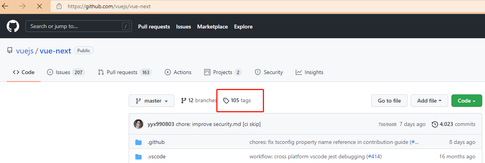
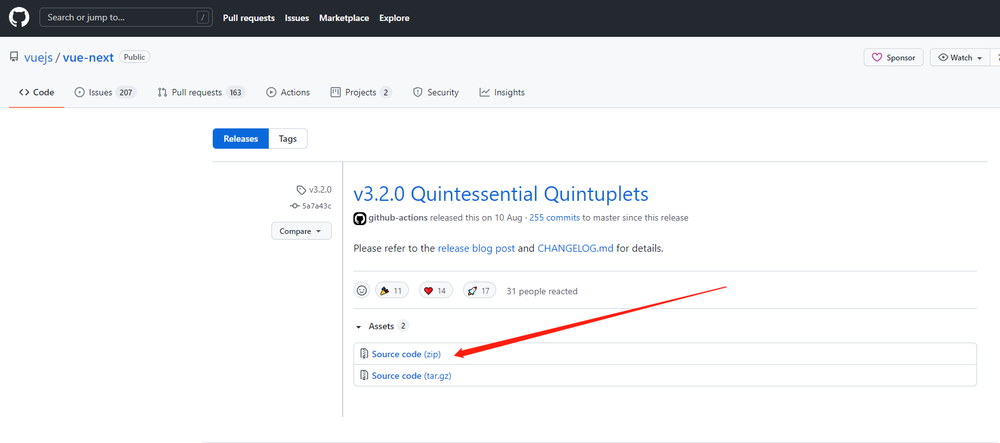

# Vue3.2源码阅读笔记——代码调试

## 下载源码

vue3目前一直在更新，所以会不同的版本。我们可以选择自己想要的版本进行阅读。GitHub中提供了打tags功能。

我们在tags列表找到[v3.2.0版本](https://github.com/vuejs/vue-next/releases/tag/v3.2.0),然后下载source code。

下载完成之后，解压用vscode打开，然后执行 npm i，下载相关依赖数据。

## 构建代码

修改 package.json,

