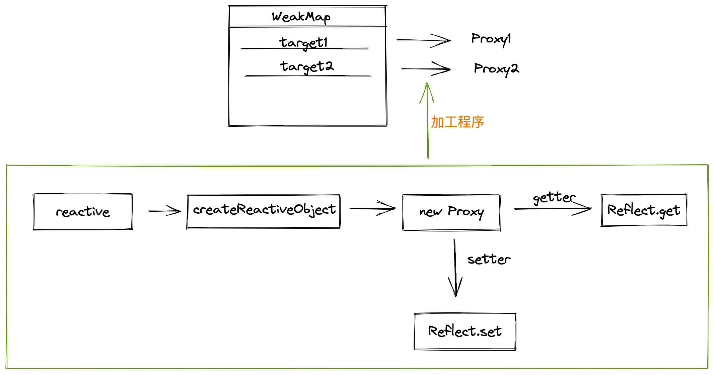
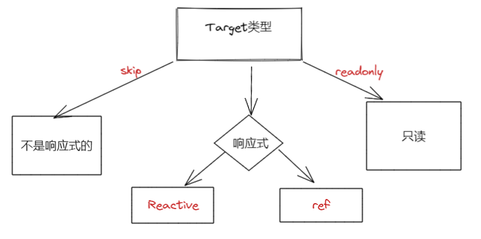

# 图解 vue-reactive

最近笔记者在阅读vue3的源码，为了巩固知识，就整理了关于reactive的流程图，同时也便于大家理解vue3中的响应式原理。

- 响应式对象
- effect

*本文 Vue源码版本是3.2,为了方便理解，函数名与源码保持一致，但删减代码一些判断逻辑，只关注主流程*

## getter/setter

vue3的使用 [[Proxy](https://developer.mozilla.org/zh-CN/docs/Web/JavaScript/Reference/Global_Objects/Proxy)] 来创建代理对象，从而实现基本操作的拦截和自定义(如属性查找、赋值、枚举、函数调用等。为了更快的理解原理，我们目前只关注getter/setter。

我们从reactive代码入口的地方开始分析.

```typescript
//==== reactive.ts

// 1.创建 存储 reactive 的数据类型 Map
export const reactiveMap = new WeakMap<Target, any>()

// target 是我们需要转换的目标对象，例如： const a = {name: 'a'}
export function reactive(target: object) {
  // 2.定义响应式对象
  return createReactiveObject(
    target,
    false,
    mutableHandlers,
    mutableCollectionHandlers,
    reactiveMap
  )
}

function createReactiveObject(
  target: Target,
  isReadonly: boolean,
  baseHandlers: ProxyHandler<any>,
  collectionHandlers: ProxyHandler<any>,
  proxyMap: WeakMap<Target, any>
) {
  // 3.调用 new Proxy
  const proxy = new Proxy(
    target,
    baseHandlers
  )
  // 4. 把响应式对象存储到 reactiveMap 中
  proxyMap.set(target, proxy)
  return proxy
}

// ==== baseHandlers.ts
// 3.1.创建 getter/setter
export const mutableHandlers: ProxyHandler<object> = {
  get: createGetter,
  set: createSetter,
}
// 创建 getter
function createGetter() {
  return function get(target: Target, key: string | symbol, receiver: object) {
    const res = Reflect.get(target, key, receiver)
    return res
  }
}
// 创建 setter
function createSetter() {
  return function set(target: object,key: string | symbol,value: unknown,receiver: object): boolean {
    const result = Reflect.set(target, key, value, receiver)
    return result
  }
}

```

简单总结一下：

- vue3会用一个WeakMap来存储响应式对象数据，key是普通对象，value是响应式对象
- 通过Proxy和Reflect把普通对象转换成响应式对象

流程图如下：




## effect


首先我们阅读vue的版本是3.2.19。

代码地址：https://github.com/vuejs/vue-next/blob/master/packages/reactivity/src/reactive.ts

官方文档地址：https://v3.cn.vuejs.org/api/basic-reactivity.html#reactive

在分析之前，我们得提出问题，vue3是如何实现 reactive？理解了 reactive 也就是理解了 vue3的响应式原理。

## reactive 入口函数

我们从 reative 入口函数走起

```typescript

export function reactive(target: object) {
  // if trying to observe a readonly proxy, return the readonly version.
  // 如果 target 是 只读 的proxy,则返回 target自身
  if (target && (target as Target)[ReactiveFlags.IS_READONLY]) {
    return target
  }
  // 定义响应式对象
  return createReactiveObject(
    target,
    false,
    mutableHandlers,
    mutableCollectionHandlers,
    reactiveMap
  )
}

```

## 理解 Target 四个属性

```typescript
// 字符串 常量枚举
export const enum ReactiveFlags {
  SKIP = '__v_skip',
  IS_REACTIVE = '__v_isReactive',
  IS_READONLY = '__v_isReadonly',
  RAW = '__v_raw'
}

// 接口 Target key 是 ReactiveFlags中定义的枚举
export interface Target {
  [ReactiveFlags.SKIP]?: boolean
  [ReactiveFlags.IS_REACTIVE]?: boolean
  [ReactiveFlags.IS_READONLY]?: boolean
  [ReactiveFlags.RAW]?: any
}

```

- __v_skip

通过 测试用例 我们知道，当target 对象上有 __v_skip 属性为true时，此时的target就不是 响应式的。

** *此属性在阅读vnode的时候会被用上*

```js
  test('should not observe objects with __v_skip', () => {
    const original = {
      foo: 1,
      __v_skip: true
    }
    const observed = reactive(original)
    // 判断 是否为 reactive
    expect(isReactive(observed)).toBe(false)
  })
```

- __v_isReactive

  当target上有 __v_isReactive 属性并且为true时，代表此target已经是响应式，并且是 reactive

- __v_isReadonly

  当target上有 __v_isReadonly属性并且为true时，代表此target是只读，不能进行修改

- __v_raw

  当target上有 __v_raw属性并且为true时，代表此target已经是响应式，并且是 ref

vue3中有两种响应式，一种是通过 reative,另一种是 ref。

一图总结



## 理解 TargetType

```typescript
// 目标对象 数据类型 集合
const enum TargetType {
  INVALID = 0, // 无效：不能被转换成响应式
  COMMON = 1,  // 普通型：Object、Array 类型
  COLLECTION = 2 // 收集型：Set、Map、WeakMap、WeakSet类型
}
// 目标对象 类型
function targetTypeMap(rawType: string) {
  switch (rawType) {
    case 'Object':
    case 'Array':
      return TargetType.COMMON
    case 'Map':
    case 'Set':
    case 'WeakMap':
    case 'WeakSet':
      return TargetType.COLLECTION
    default:
      return TargetType.INVALID
  }
}
// 获取目标对象 类型，返回值是 TargetType
function getTargetType(value: Target) {
  // ReactiveFlags.SKIP => true, 代表着不是响应式数据（上文已经分析过了)
  // Object.isExtensible() 方法判断一个对象是否是可扩展的（是否可以在它上面添加新的属性）
  
  // toRawType(value) 对应着 Object.prototype.toString.call(value).slice(8, -1)
  // extract "RawType" from strings like "[object RawType]"
  return value[ReactiveFlags.SKIP] || !Object.isExtensible(value)
    ? TargetType.INVALID
    : targetTypeMap(toRawType(value))
}
```

总结：vue3把 targetType 分为三类：

INVALID => 无效；

COMMON => 通用（Object、Array); 

 COLLECTION => 收集（Map、Set、WeakMap、WeakSet）

## createReactiveObject

前面介绍完 vue3 响应式 里自定义的属性已经数据类型，接下分析 createReactiveObject 函数，这个函数被用于多处地方。

```typescript
// 创建响应式对象
function createReactiveObject(
  target: Target,
  isReadonly: boolean,
  baseHandlers: ProxyHandler<any>,
  collectionHandlers: ProxyHandler<any>,
  proxyMap: WeakMap<Target, any>
) {
    // 判断 是为对象类型
    // isObject => () => val !== null && typeof val === 'object'
  if (!isObject(target)) {
    if (__DEV__) {
      console.warn(`value cannot be made reactive: ${String(target)}`)
    }
    return target
  }

  // 过滤 通过 ref 声明 的响应式对象
  if (
    target[ReactiveFlags.RAW] &&
    !(isReadonly && target[ReactiveFlags.IS_REACTIVE])
  ) {
    return target
  }

  // 判断 target 是否转变成 响应式对象
  const existingProxy = proxyMap.get(target)
  if (existingProxy) {
    return existingProxy
  }

  // 确认 target 的数据类型
  const targetType = getTargetType(target)
  if (targetType === TargetType.INVALID) {
    // 无效的 target,直接返回
    return target
  }

  // TargetType.COLLECTION => collectionHandlers
  // TargetType.COMMON => baseHandlers
  // 通过 Proxy 转换成 响应对象，并存储到 对应的proxyMap 中
  const proxy = new Proxy(
    target,
    targetType === TargetType.COLLECTION ? collectionHandlers : baseHandlers
  )
  proxyMap.set(target, proxy)
  return proxy
}
```


