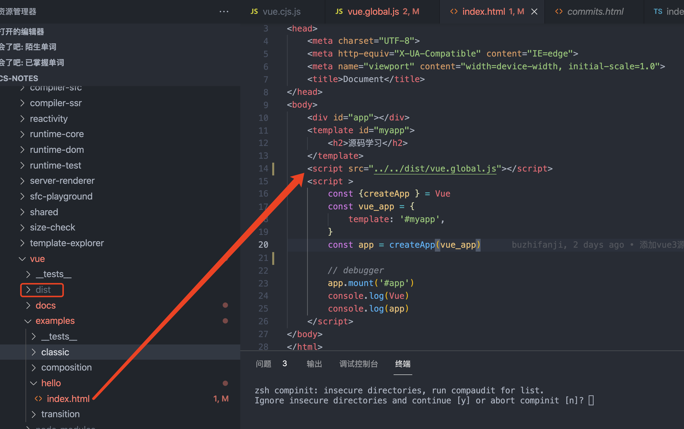

# Vue3.2源码阅读笔记——代码调试

## 下载源码

vue3目前一直在更新，所以会不同的版本，那么我们如何选择自己想要的版本进行阅读呢？GitHub中提供了打tags功能，它这里列出了不同版本号的代码。


我们在tags列表找到[v3.2.0版本](https://github.com/vuejs/vue-next/releases/tag/v3.2.0),然后下载source code。


下载完成之后，解压用vscode打开，然后在终端执行 npm i，下载相关依赖数据。

## 构建代码

把 package.json的dev属性修改成如下,因为修改后可以生产sourceMap文件了，有了这个代码，我们就可以debugger调试代码了。

```json
"dev": "node scripts/dev.js --sourcemap"
```

修改好后，在终端执行命令

```js
npm run dev
```

## 调试例子

我们刚才打包好的代码存放在 packages/vue/dist 目录里。然后我们在 packages/vue/examples 新建我们的demo文件。例子如下图



在浏览器里打开这个文件，我们就可以调试代码了。