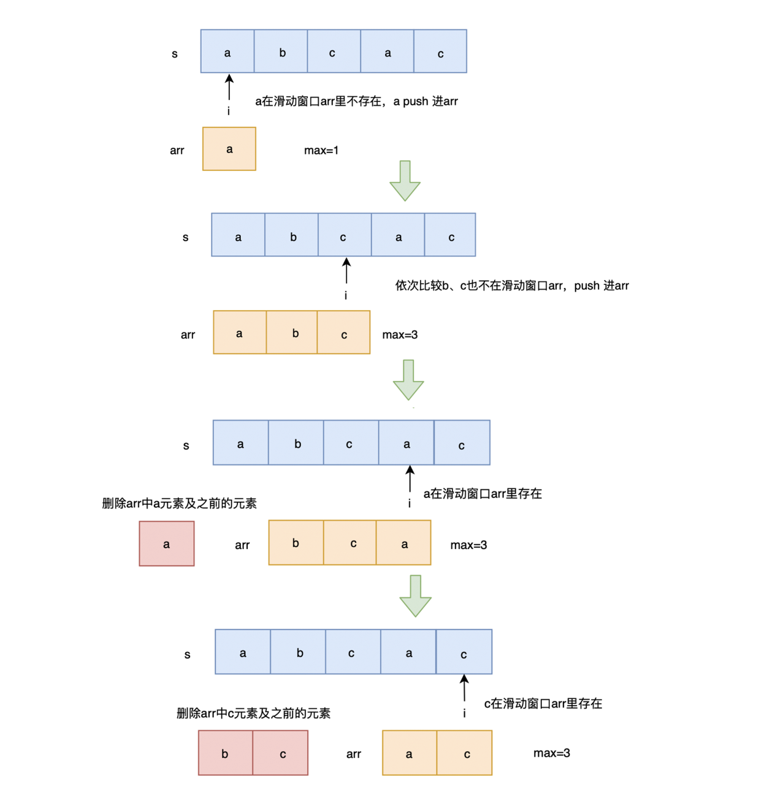

# 无重复字符的最长子串

给定一个字符串 s ，请你找出其中不含有重复字符的 最长子串 的长度。

来源：力扣（LeetCode）链接：https://leetcode-cn.com/problems/longest-substring-without-repeating-characters/

### 解法一：维护数组

使用一个数组来维护**滑动窗口**

-  不存在则 push 进数组
-  存在就删除滑动窗口数组里相同字符及相同字符前的字符，然后将当前字符 push 进数组
-  然后将 max 更新为当前最长子串的长度

### 图解



### 代码实现

```js
/**
 * @param {string} s
 * @return {number}
 */
var lengthOfLongestSubstring = function(s) {
    let arr = [],
        max = 0;
    for (let i = 0; i < s.length; i++) {
        const item = s[i]
        const index = arr.indexOf(item)
        if (index !== -1) {
            arr.splice(0, index + 1)
        }
        arr.push(item)
        max = Math.max(arr.length, max)
    }
    return max
};

```

**时间复杂度**：O(n2)，其中 arr.indexOf() 时间复杂度为 O(n) ，arr.splice(0, index+1) 的时间复杂度也为 O(n)

**空间复杂度**：O(n)

## Map 空间换时间

### 解题思路

使用 map 来存储当前已经遍历过的字符，key 为字符，value 为下标

使用 i 来标记无重复子串开始下标，j 为当前遍历字符下标

遍历字符串，判断当前字符是否已经在 map 中存在，存在则更新无重复子串开始下标 i 为相同字符的下一位置，此时从 i 到 j 为最新的无重复子串，更新 max ，将当前字符与下标放入 map 中

### 代码实现


```js
/**
 * @param {string} s
 * @return {number}
 */
var lengthOfLongestSubstring = function(s) {
    let map = new Map(),
        max = 0,
        index = 0;
    for (let i = 0; i < s.length; i++) {
        const item = s[i]
        if (map.has(item)) {
            const temp = map.get(item)
            // 找到重复 字符的下标 索引
            index = Math.max(temp + 1, index)
        }
        // 更新最长 数量
        max = Math.max(i - index + 1, max)
        map.set(item, i)
    }
    return max
};

```
**时间复杂度**：O(n)

**空间复杂度**：O(n)